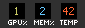

# GpuTray-Minimal

A lighter-weight Windows system tray application that monitors GPU performance and resource usage with a dynamic cycling icon.



## Features

- **Dynamic Tray Icon**:
  - Real-time readout directly in the systray icon:
    - **GPU Usage** (%) - green
    - **VRAM Usage** (%) - blue
    - **GPU Temperature** (C) - orange
  - Cycles every two seconds.
  - Refresh rate: **0.5 FPS** (Once every 2 seconds).
- **Sleek Popup Tooltip** (Mouseover):
  - Basic readout for 3 key metrics: GPU, VRAM & TEMP
- Two-click exit button.

## Technologies Used

- **C++17**: Modern pain-in-the-ass-oriented code.
- **Win32 API**: Low-level Windows system integration.
- **GDI+**: High-quality 2D graphics rendering for icons.
- **PDH (Performance Data Helper)**: Precise performance counter gathering.
- **DXGI**: Accurate Video Memory (VRAM) tracking.
- **WMI**: System temperature retrieval.

## Temperature Monitoring Logic

The application uses real-time metrics to ensure accurate GPU temperature readings across different hardware:

### GPU Temperature
1. **Primary (NVML)**: Standard for NVIDIA GPUs. If `nvml.dll` is present, it directly communicates with the NVIDIA Management Library for high-precision real-time metrics.
2. **Fallback (WMI)**: For integrated or non-NVIDIA GPUs, it queries the `Win32_VideoController` WMI class to retrieve available thermal data.

## Getting Started

### Butchered from

[GpuTray](https://github.com/kirinonakar/GpuTray)

## Building from Source

### Prerequisites

- Windows 10
- MinGW-w64
- CMake 3.10+

### Steps

1. Clone the repository.
2. Build in the MingW64 prompt:
   - **Manual**:
     ```bash
     mkdir build
     cd build
     cmake .. -G "MinGW Makefiles"
     mingw32-make
     ```
3. Run `GpuTray.exe` from `build/`

## Usage

- Launch `GpuTray.exe` - icon appears in system tray
- **Hover**: Tooltip shows GPU %, VRAM %, TEMP(C)
- **Right-Click**: Exit menu

## License

MIT - see [LICENSE](LICENSE)
